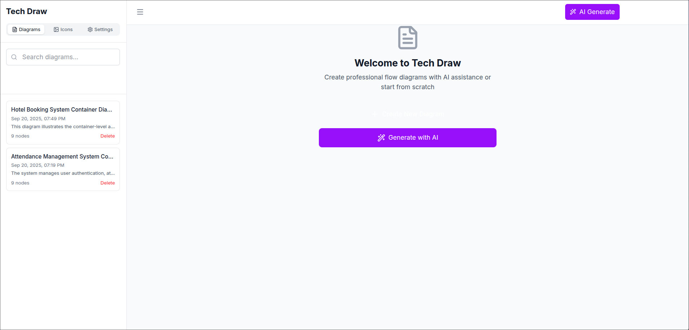
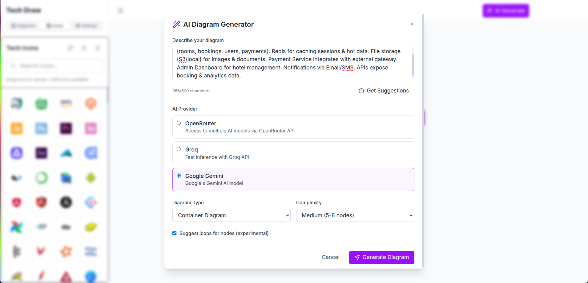
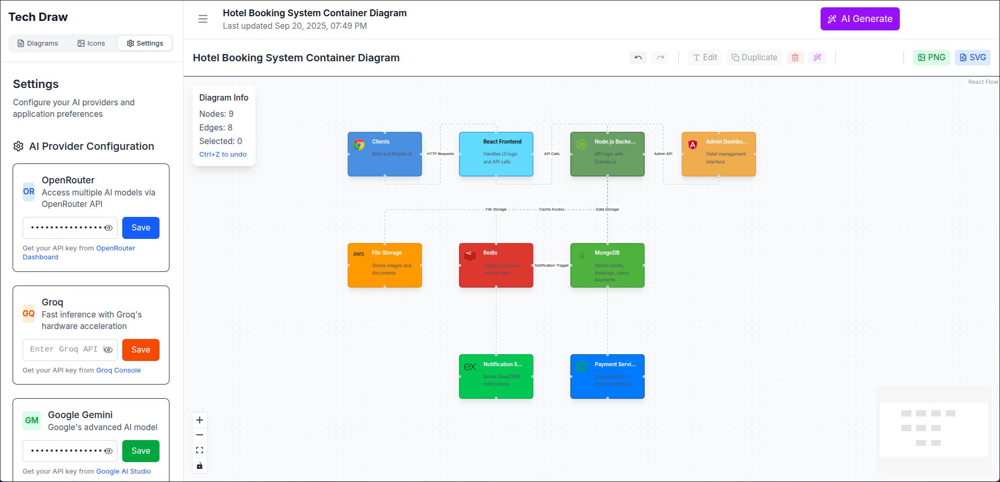

# TechDraw - AI-Powered System Architecture Diagram Generator

[](https://reactjs.org/)
[](https://www.typescriptlang.org/)
[](https://vitejs.dev/)

TechDraw is a modern, AI-powered visual diagramming application designed for creating system architecture diagrams, workflow visualizations, and technical documentation. Built with React Flow and powered by multiple AI providers, it enables developers and architects to quickly generate and customize professional diagrams for local workflows and system architecture documentation.

## 🌟 Features

### Core Functionality

- **Interactive Diagram Editor**: Drag-and-drop interface with React Flow
- **AI-Powered Generation**: Generate diagrams from natural language descriptions
- **Rich Icon Library**: 500+ technology icons (AWS, Azure, Docker, Kubernetes, etc.)
- **Multiple Export Formats**: PNG and SVG export capabilities
- **Real-time Editing**: Live text editing with context menus
- **Node Management**: Create, edit, delete, duplicate, and connect nodes
- **Undo/Redo**: Full history management with keyboard shortcuts

### AI Integration

- **Multi-Provider Support**:
  - OpenAI (GPT-4, GPT-3.5)
  - Anthropic Claude
  - Google Gemini
  - Groq (Llama models)
- **Intelligent Node Placement**: AI automatically arranges nodes logically
- **Context-Aware Modifications**: AI understands existing diagram structure
- **Technology Recognition**: AI suggests appropriate icons based on context

### User Experience

- **Responsive Design**: Works seamlessly on desktop and tablet
- **Keyboard Shortcuts**: Efficient workflow with hotkeys
- **Local Storage**: Auto-save and persistent diagram storage
- **Modern UI**: Clean, professional interface with Tailwind CSS
- **Performance Optimized**: Smooth interactions even with large diagrams

## 📸 Screenshots

### Homepage


*Clean, modern interface for creating and managing diagrams*

### AI Diagram Generation


*AI-powered diagram generation from natural language*

### Generated Diagram


*Professional system architecture diagram with technology icons*

### API Configuration


*Easy configuration for multiple AI providers*

## 🚀 Quick Start

### Prerequisites

- Node.js 18+
- npm or yarn
- Modern web browser

### Installation

1. **Clone the repository**

   ```bash
   git clone https://github.com/yourusername/techdraw.git
   cd techdraw
   ```
2. **Install dependencies**

   ```bash
   npm install
   ```
3. **Configure AI providers** (optional)

   - Create a `.env.local` file in the root directory
   - Add your API keys:

   ```env
   VITE_OPENAI_API_KEY=your_openai_key_here
   VITE_ANTHROPIC_API_KEY=your_anthropic_key_here
   VITE_GOOGLE_API_KEY=your_google_key_here
   VITE_GROQ_API_KEY=your_groq_key_here
   ```
4. **Start development server**

   ```bash
   npm run dev
   ```
5. **Open your browser**
   Navigate to `http://localhost:5173`

## 📖 Usage Guide

### Creating Your First Diagram

1. **Manual Creation**

   - Click the "+" button or press `Space` to add nodes
   - Select from 500+ technology icons
   - Connect nodes by dragging from connection points
   - Edit text by double-clicking or using context menu
2. **AI Generation**

   - Click "Generate with AI"
   - Describe your system architecture in natural language
   - Example: "Create a microservices architecture with React frontend, Node.js API, PostgreSQL database, and Redis cache, deployed on AWS"
   - Choose your preferred AI provider
   - Review and customize the generated diagram

### Advanced Features

#### Context Menu Actions

Right-click any node to access:

- **Edit**: Modify text, icon, and styling
- **Copy**: Duplicate nodes with Ctrl+C
- **Delete**: Remove nodes and connections
- **AI Modify**: Intelligently update existing nodes

#### Keyboard Shortcuts

- `Space`: Add new node
- `Ctrl+S`: Save diagram
- `Ctrl+Z`: Undo
- `Ctrl+Y`: Redo
- `Ctrl+C`: Copy selected nodes
- `Ctrl+V`: Paste nodes
- `Ctrl+D`: Duplicate selection
- `Delete`: Remove selected items

#### Export Options

- **PNG Export**: High-quality raster images for presentations
- **SVG Export**: Scalable vector graphics for documentation
- **Local Storage**: Automatic saving and loading

## 🛠️ Technology Stack

### Frontend

- **React 19.1.1**: Modern React with hooks and concurrent features
- **TypeScript**: Type-safe development
- **React Flow**: Interactive node-based editor
- **Tailwind CSS**: Utility-first styling
- **Lucide React**: Beautiful icon system

### AI Integration

- **OpenAI API**: GPT models for intelligent generation
- **Anthropic Claude**: Advanced reasoning capabilities
- **Google Generative AI**: Gemini models
- **Groq**: High-performance inference

### Build Tools

- **Vite**: Lightning-fast development and building
- **ESLint**: Code quality and consistency
- **HTML2Canvas**: Client-side screenshot generation
- **html-to-image**: Advanced image export

## 🏗️ Architecture

```
src/
├── components/          # React components
│   ├── nodes/          # Custom node types
│   ├── ContextMenu.tsx # Right-click menu
│   ├── EditModal.tsx   # Node editing interface
│   └── AIModifyModal.tsx # AI modification dialog
├── lib/                # Core libraries
│   ├── ai.ts          # AI provider integrations
│   ├── exportService.ts # Export functionality
│   └── utils.ts       # Utility functions
├── types/             # TypeScript definitions
├── hooks/             # Custom React hooks
└── App.tsx           # Main application component
```

## 🤝 Contributing

We welcome contributions! Please see our [CONTRIBUTING.md](CONTRIBUTING.md) for guidelines on:

- Adding new technology icons ( current icon sourced from [https://techicons.dev/](https://techicons.dev/) )
- Improving AI integrations
- Code contributions
- Bug reports and feature requests

## 📝 Use Cases

### Software Architecture

- Microservices diagrams
- Database schemas
- API workflows
- Deployment architectures

### Cloud Infrastructure

- AWS/Azure/GCP architectures
- Container orchestration
- CI/CD pipelines
- Network topologies

### System Design

- Data flow diagrams
- Service dependencies
- Integration patterns
- Technical documentation

## 🔒 Privacy & Security

- **Local-First**: All diagrams stored locally in your browser
- **API Key Security**: Keys stored securely in browser storage
- **No Data Collection**: No telemetry or user tracking
- **Open Source**: Full transparency and auditability

## 🐛 Known Issues

- Large diagrams (50+ nodes) may experience performance degradation
- SVG export may not preserve all styling in some browsers
- AI generation quality varies by provider and prompt complexity

## 🙏 Acknowledgments

- [React Flow](https://reactflow.dev/) for the excellent diagramming foundation
- [Lucide](https://lucide.dev/) for beautiful icons
- [Tailwind CSS](https://tailwindcss.com/) for the design system
- [TechIcons.dev](https://techicons.dev/) for the icons packs.
- The open-source community for inspiration and support

## 📧 Support

- **Issues**: Report bugs on [GitHub Issues](https://github.com/yourusername/techdraw/issues)
